Naming conventions for unit tests
=====


The following guide is intended to standardize the creation and definition of IDs names for elements and components for e-commerce projects in I2B Technologies and  theunit tests that should be done once created their functionality. 

It relies on the [Frontend Code Guide](frontend-guide_EN.md) and on [MutableCSS](mutable-css_EN.md) for it's conception and implementation.

---

**Base pattern:** 

For every [component](mutable-css_EN.md#components) (individual functionality that contains a set of elements):
- lowerCamelCased
- en english
- the first word lowercase and singular and represents the function of the component
- second word is `Box`
- Broad components should not be necessarily it's sub-components named, eg. *products page* or *products filters options*. Just name the main component (shown in this document with a 👓).

Eg: `loginBox`, `registerBox`, `cartBox`, `filterBox`

For any [element](mutable-css_EN.md#elements) (indivisible elements that have specific function within your component):
- lowercase
- in english
- no spaces
- the first word inherits the functionality of the component in which it resides
- the second word is the element's action
- the third corresponds to the selector or type of element

Ej: `loginsubmitbutton`, `recoveryerrormessage`

---

## Login
```
#loginBox
    #loginusernameinput
    #loginpasswordinput
    #loginsubmitbutton
    #logincancelbutton
    #loginerrormessage
```

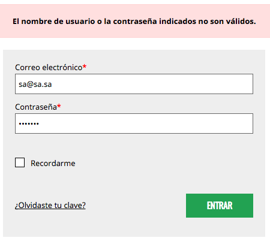

## Forgotten password
```
#recoveryBox
    #recoveryemailinput
    #recoverysubmitbutton
    #recoverycancelbutton
    #recoveryerrormessage
```

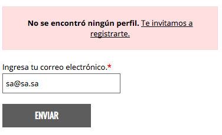

## Register
```
#registerBox
    #registerfirstnameinput
    #registerlastnameinput
    #registerpasswordinput
    #registerrepeatpasswordinput
    #registertermsconditionscheckbox
    #registersubmitbutton
    #registercancelbutton
    #registererrormessage
```

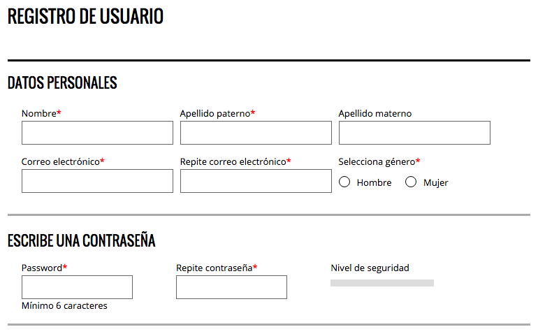

## Shopping cart

```
#cartBox
    #cartemptybutton
    #cartpaybutton
```

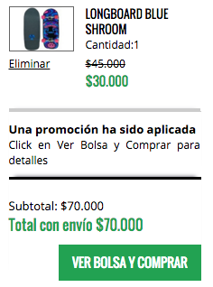

## Search
```
#searchBox
    #searchtextinput
    #searchsubmitbutton
```

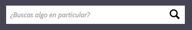

## Paginator 👓
```
#paginationBox
```

## Discount coupon
```
#couponBox
    #couponcodeinput
    #couponsubmitbutton
```

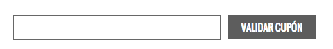

## Filters

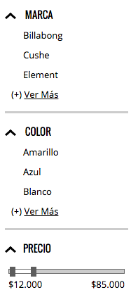

### Price
```
#filterPriceBox 👓
```

### Brand 👓
```
#filterBrandBox
```

### Color 👓
```
#filterColorBox
```

### Product quantity 👓
```
#productsquantityselect
```

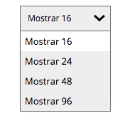

### Products order 👓
```
#productsorderselect
```

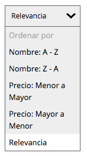

## Products

For every individual product container shall be taken as a unique identifier to the nomenclature the suffix product's [SKU] and UPPERCASED.

### Product overview 👓

For every page that contains a list of products, the format should include the following standard components:

```
#productBox[SKU]
```

![productBox[SKU]](images/productBox[SKU].png)

### Single product

```
#productSingleBox
    #productbuybutton
    #productaddtocartbutton
    #productzoombutton
```

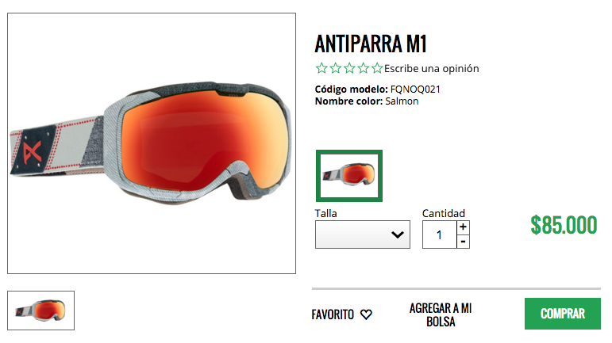

### Checkout

```
#checkoutBox
    #checkoutproductbox[SKU]
```

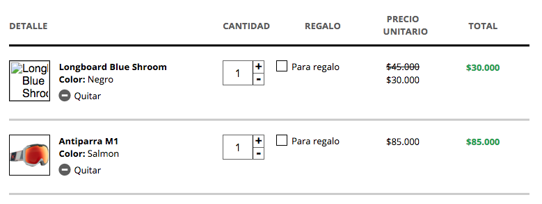

### Shipping

```
#shippingCheckoutBox
    #shippingcheckout[option]
```

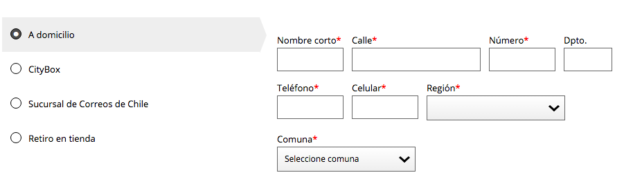

### Purchase summary 👓

```
#checkoutResumeBox
```

### Payment method

```
#paymentCheckoutBox
	#paymentcheckout[option]
```

### Confirm payment

```
#paymentConfirmBox
	#paymentconfirmbutton
	#paymentcancelbutton
```

### Successful payment 👓

```
#paymentSuccessBox
```

### Rejected payment 👓

```
#paymentRejectBox
```
